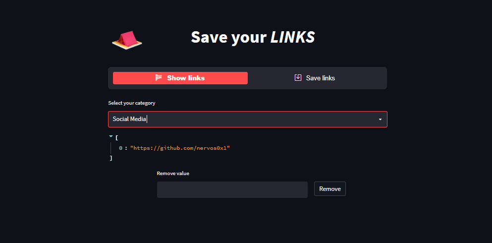

<!-- Header -->
<div align="center">
  <a href="">
    
  </a>
  <h3 align="center">Save links - Streamlit</h3>
  <p align="center">
    save your links quickly 
    <br />
  </p>
</div>

<!-- TABLE -->
<details>
  <summary>Table of Contents</summary>
  <ol>
    <li>
      <a href="#about-the-project">About The Project</a>
      <ul>
        <li><a href="#built-with">Built With</a></li>
      </ul>
    </li>
    <li>
      <a href="#getting-started">Getting Started</a>
      <ul>
        <li><a href="#prerequisites">Prerequisites</a></li>
        <li><a href="#installation">Installation</a></li>
      </ul>
    </li>
    <li><a href="#contributing">Contributing</a></li>
    <li><a href="#contact">Contact</a></li>
  </ol>
</details>


<!-- ABOUT -->
## About The Project

It is a simple application to help you save your links and text that you have copied.

I created this application to learn and practice my skills if you have any suggestions please contact me.

why use:
* If you are using a lot of browser, you need this app to get a link quickly ;D


<!-- Built -->
### Built With
* Python
* Json
* Docker

Libraries:
- streamlit
- streamlit_option_menu
- json
- PIL
- os


<hr/>

<!-- GETTING STARTED -->
## Getting Started
To run the application, simply follow these steps:

### Prerequisites
- Python 
- Docker 

### Installation
1. Clone the repo
   ```sh
   git clone https://github.com/your_username_/Project-Name.git
   ```
2. Go to the paste
    ```sh
    cd save_link
    ```
3. Up docker-compose
    ```sh
    docker-compose up -d
    ```

<hr/>

<!-- CONTRIBUTING -->
## Contributing


1. Fork the Project
2. Create your Feature Branch (`git checkout -b feature/AmazingFeature`)
3. Commit your Changes (`git commit -m 'Add some AmazingFeature'`)
4. Push to the Branch (`git push origin feature/AmazingFeature`)
5. Open a Pull Request

<hr/>


<!-- CONTACT -->
## Contact

Lucas Moreira - [@linkedIn](https://www.linkedin.com/in/lcsmoreira/) - lucasalvesmoreira012@gmail.com

Project Link: [Save your Link](https://github.com/your_username/repo_name)

